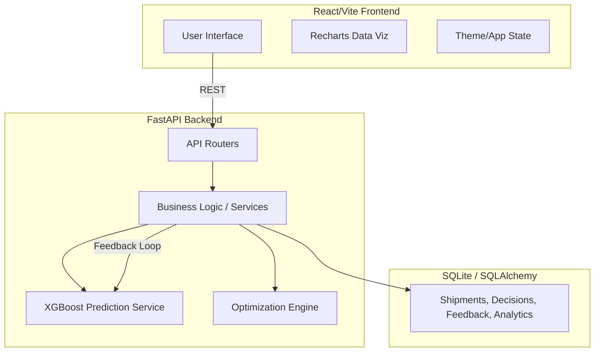

# SupplyPrescript: Closed-Loop Prescriptive Analytics

SupplyPrescript is a complete modern web application for supply chain analytics. It goes beyond simple forecasting (Predictive Analytics) by incorporating **Prescriptive Analytics**—it tells you *what* will happen, *why* it will happen, and exactly *what action to take*. Furthermore, it features a **Closed-Loop Feedback System** that tracks the outcome of executed decisions and automatically flags the ML model for retraining if variance exceeds thresholds.

---

## 🚀 Features

- **Shipment Management**: Complete CRUD operations for tracking shipments.
- **Predictive ML Engine**: Predicts delays using a trained XGBoost classifier.
- **Prescriptive Recommendations**: Provides optimized alternative transport options based on budget, inventory constraints, and urgency.
- **Decision Execution**: Allows users to select and log recommended actions.
- **Closed-Loop Analytics (Feedback Loop)**: Analyzes the actual outcome vs predicted outcome of past decisions. Tracks Cost Variance, Delay Variance, and overall Decision Success Rate.
- **Modern Interactive Dashboard**: Light/Dark mode, beautiful Recharts visualizations (Pie charts, Trend areas, Bar charts), animated skeletons, and real-time Toast notifications.

---

## 🏗️ Architecture



---

## 💻 Technology Stack

- **Frontend**: React 18, Vite, React Router, Recharts, React-Toastify, Vanilla CSS (Dark Mode).
- **Backend**: FastAPI, Pydantic, SQLAlchemy, Uvicorn.
- **Machine Learning**: Scikit-Learn, XGBoost, Pandas, Numpy.
- **Database**: SQLite (Development).

---

## 📂 Project Structure

```text
SupplyPrescript/
├── backend/
│   ├── app/
│   │   ├── api/          # FastAPI Routes (Shipments, Models, Analytics, etc.)
│   │   ├── core/         # Configs (CORS, Settings)
│   │   ├── database/     # DB Setup
│   │   ├── ml/           # ML Models and Prediction Logic
│   │   ├── models/       # SQLAlchemy Models
│   │   ├── optimization/ # Constraint checking and recommendation generation
│   │   ├── schemas/      # Pydantic validation schemas
│   │   └── services/     # Business logic layer
│   ├── data/             # CSV mock data
│   ├── scripts/          # Database seeding scripts
│   ├── requirements.txt
│   └── main.py           # Application Entry point
│
└── frontend/
    ├── src/
    │   ├── components/   # Reusable UI (Spinners, Skeletons, Sidebar, TopNav)
    │   │   └── charts/   # Recharts Components
    │   ├── contexts/     # ThemeContext (Dark/Light mode)
    │   ├── hooks/        # Custom React Hooks
    │   ├── pages/        # Dashboard, Shipments, Analytics, Decisions, Settings
    │   ├── services/     # Axios API wrappers
    │   ├── App.jsx       # Main Application layout and routing
    │   └── main.jsx
    ├── package.json
    └── vite.config.js
```

---

## 🛠️ Setup Instructions

### 1. Backend Setup

```bash
cd backend
python -m venv venv
source venv/bin/activate
pip install -r requirements.txt

# Run the development server
uvicorn app.main:app --reload --port 8000
```
> The API will be running at `http://localhost:8000`. Swagger UI docs available at `http://localhost:8000/docs`.

### 2. Frontend Setup

```bash
cd frontend
npm install

# Run the development server
npm run dev
```
> The frontend will be running at `http://localhost:5173`.

---

## 📊 Analytics Definitions

- **Success Rate**: % of decisions where Actual Cost $\le$ Predicted Cost AND Actual Delay $\le$ Predicted Delay.
- **ROI**: (Total Savings / Total Predicted Cost of Successful Decisions) * 100.
- **Cost Variance**: Actual Cost - Predicted Cost.
- **Delay Variance**: Actual Delay - Predicted Delay.

## 👥 Contributors
Developed by the SupplyPrescript Team.
