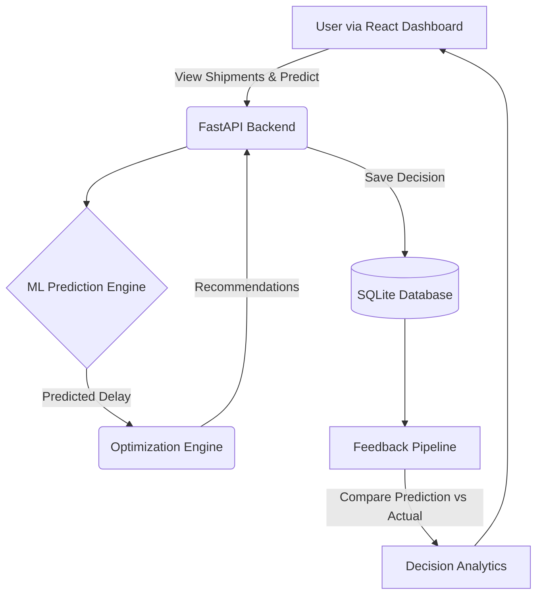

# SupplyPrescript: Closed-Loop Prescriptive Analytics

An AI-powered decision support system that predicts shipment delays, suggests the best business action using optimization, and allows users to execute decisions through a web dashboard. The application features a fully closed-loop analytics pipeline that continuously monitors the outcome of decisions and marks the ML models for retraining when variance is high.

## Architecture



## Tech Stack
- **Frontend**: React.js, Vite, Recharts, React Router
- **Backend**: FastAPI (Python), SQLAlchemy, Pydantic
- **Machine Learning**: XGBoost, Scikit-learn
- **Optimization**: SciPy, PuLP
- **Database**: SQLite 

## Folder Structure
```
SupplyPrescript/
├── backend/            
│   └── app/            # FastAPI application
│       ├── api/        # API routers (shipments, predictions, analytics)
│       ├── core/       # Configurations
│       ├── database/   # DB and session config
│       ├── ml/         # ML models loader and prediction logic
│       ├── models/     # SQLAlchemy models (Shipment, Decision)
│       ├── optimization/ # SciPy/PuLP optimization logic
│       ├── schemas/    # Pydantic schemas
│       └── services/   # Business logic (e.g., analytics.py)
├── frontend/           
│   └── src/            # React application
│       ├── components/ # Reusable UI components
│       ├── pages/      # Route pages (Dashboard, Analytics, etc.)
│       └── services/   # Axios API calls
├── data/               # Raw and processed datasets
├── notebooks/          # Jupyter notebooks for model training
├── models/             # Saved ML models
└── docs/               # Project documentation
```

## Installation & Setup

### 1. Backend
Navigate to the `backend/` directory:
```bash
cd backend
python -m venv venv
source venv/bin/activate  # On Windows: venv\Scripts\activate
pip install -r requirements.txt
uvicorn app.main:app --reload
```
The API documentation will be available at `http://localhost:8000/docs`.

### 2. Frontend
Navigate to the `frontend/` directory:
```bash
cd frontend
npm install
npm run dev
```
The React app will be available at `http://localhost:5173`.

## Core APIs

### Shipments
- `GET /api/v1/shipments/` - List shipments
- `POST /api/v1/shipments/` - Create a shipment
- `PUT /api/v1/shipments/{id}` - Update a shipment
- `DELETE /api/v1/shipments/{id}` - Delete a shipment

### Predictions & Recommendations
- `POST /api/v1/predictions/predict` - Predict shipment delay based on logistics metadata.
- `POST /api/v1/recommendations/` - Generate optimal actions based on predictions and budget constraints.

### Analytics (Closed-Loop)
- `POST /api/v1/analytics/decisions` - Save an executed decision.
- `GET /api/v1/analytics/dashboard` - Retrieve decision stats and success metrics.
- `POST /api/v1/analytics/feedback` - Run the feedback pipeline to evaluate decisions against actual outcomes.

## Screenshots
*(Insert screenshots of the Dashboard and Analytics view here)*

## Future Enhancements
- **Automated Model Retraining**: Trigger retraining jobs using Apache Airflow when feedback pipeline detects > 15% variance.
- **PostgreSQL Migration**: Move from SQLite to PostgreSQL for production concurrency.
- **User Authentication**: Add JWT-based auth and Role-Based Access Control (RBAC).
- **Advanced Visualizations**: Implement geographic maps for shipment tracking.
